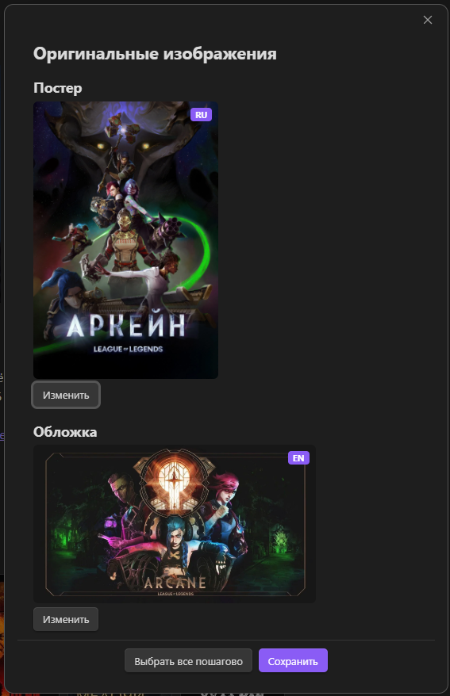

# **English** | **[Русский](README_RU.md)**

# ⚠️ Breaking Changes Notice

**Version 2.0.0 introduces breaking changes.** Please review the [CHANGELOG (v2.0.0)](CHANGELOG.md#200--2025-08-xx) before updating.

# Credits

Based on the original work by [Alintor](https://github.com/Alintor) and [2PleXXX](https://github.com/2PleXXX)

# Plugin Differences

Key differences between the [original plugin](https://github.com/Alintor/obsidian-kinopoisk-plugin) and this plugin:

1. **Extended variable support** - More template variables are now available.
2. **Image storage toggle** - Option to enable/disable saving images to your vault.
3. **Bilingual support** - Switch between English and Russian interface.
4. **Improved UI and UX** – The user interface and experience have been refined for smoother interaction.
5. **Better Obsidian compatibility** - Improved integration with Obsidian features
6. **Bug fixes** - Minor issues from the original version have been resolved

# Obsidian TMDB search Plugin

Easily search movies and TV shows info via Kinopoisk and create notes.

# Description

Search movies and TV shows information from Kinopoisk database.

Uses the Kinopoisk.dev API to retrieve comprehensive film and series data.

# How to install

**Option 1:** Manual installation - download the latest release files (`main.js`, `manifest.json`, `styles.css`) from [Releases](https://github.com/Yanoky1/obsidian-tmdb-plugin/releases) and place them in your vault's `.obsidian/plugins/tmdb-search/` folder.


# How to use

### 1. Click the ribbon icon, or execute the command "TMDB search"


### 2. Search for movies or TV series by keywords


### 3. Select the item from the search results


### 4. Select poster



### 5. Select status


### 6. Voila! A note has been created


# Configure plugin in settings


# Get API Token

You need an API token to use this plugin.

1. Visit [developer.themoviedb.org](https://developer.themoviedb.org/docs/getting-started)
2. Choose the free plan
3. Follow the registration steps
4. Copy your API token to the plugin settings

# New file name

You can customize the file name format for generated notes.

> **Example:** Using the default format, "Arcane" would create a file named `Arcane.md`

**Default format:** `{{nameForFile}}`

This creates files like "Arcane.md"

**Learn more about naming options:** [File Naming Options](#file-naming-options)

# New file location

Set the folder location where new files are created.

If no location is specified, new files are created in the Obsidian root folder.

# Image Storage

Enable image saving in the plugin settings and specify the path to the folder where selected images will be saved.

**Default folder:** `attachments/TMDB`

**Available download options:**

-   **Posters** - Movie/TV show poster images
-   **Covers** - Wide cover images
-   **Logos** - Film/series logo images

# Template file

You can set a custom template file location to format your movie notes.

## Example template

Please refer to the template variables definitions below for available variables (see: [Template variables definitions](#template-variables-definitions)).

Here’s an example of the template I personally use:

```
---
Poster: "{{posterPath}}"
Cover: "{{coverPath}}"
Logo: "{{logoPath}}"
Name: "{{name}}"
aliases: "{{enName}}"
Year: {{year}}
Description: {{Description}}
Genres: [{{genres}}]
WatchStatus: "{{status}}"
Countries: [{{countries}}]
Actors: [{{actorsIdsWithPath}}]
Directors: [{{directorsIdsWithPath}}]
TMDBLink: "{{TMDBLink}}"
IMDbОценка: {{ratingImdb}}
IDIMDB: "{{imdbId}}"
IDTMDB: {{tmdbId}}
MovieLength: {{movieLength}}
AgeRating: {{ageRating}}
SeriesLength: {{seriesLength}}
TotalSeriesLength: {{totalSeriesLength}}
StatusSerial: "{{isComplete}}"
SeasonsCount: {{seasonsCount}}
SeriesInSeasonCount: {{seriesInSeasonCount}}

---
```

### My meta-bind-embed view
~~~
`$= (p => (p.Обложка ? "![[" + p.Обложка + "|cover]]\n" : "") + (p.Постер ? (p.Обложка ? "![[" + p.Постер + "|poster]]" : "![[" + p.Постер + "|200]]") : "") + (p.Лого ? "\n![[" + p.Лого + "|logo]]" : ""))(dv.current())`

# `$= dv.current().Название`

`BUTTON[Смотрю]` `BUTTON[Посмотрел]` `BUTTON[Буду смотреть]` `BUTTON[Забросил]`

Моя оценка: `INPUT[number(class(meta-bind-small-width)):МояОценка]`

# Описание

`VIEW[{Описание}]`


```dataviewjs
const current = dv.current();

// Вспомогательная функция для текста
const formatValue = (value) => 
    value && value !== "" && value !== "0" 
        ? Array.isArray(value) ? value.join(", ") : value 
        : null;

const createField = ([key, label]) => {
    const value = formatValue(current[key]);
    return value ? `**${label}**: ${value}` : null;
};

// --- УНИВЕРСАЛЬНАЯ ФУНКЦИЯ ПРОВЕРКИ СУЩЕСТВОВАНИЯ ---
const checkUncreated = (links) => {
    if (!links) return null;
    const linksArray = (Array.isArray(links) ? links : [links]).filter(Boolean);

    const uncreated = linksArray.filter(link => {
        if (link && link.path) {
            if (link.path.includes("/null")) return false;
            
            let fullPath = link.path;
            if (!fullPath.toLowerCase().endsWith(".md")) {
                fullPath += ".md";
            }

            const fileExists = app.vault.getAbstractFileByPath(fullPath);
            return !fileExists;
        }
        return false;
    });

    return uncreated.length > 0 ? uncreated.join(", ") : null;
};

// Функции-обертки для конкретных полей
const getUncreatedActors = () => checkUncreated(current["Актеры"]);
const getUncreatedDirectors = () => checkUncreated(current["Режиссеры"]);
const getUncreatedFilms = () => checkUncreated(current["Связанные"]);

// Блок карточек актеров
const actorsBase = `
\`\`\`base
filters: 
   and:
      - file.folder == "Dataview/Актеры_Режиссеры"
      - this.Актеры.contains(link(file))
views: 
  - type: cards
    name: Таблица
    order:
      - Название
    image: note.Постер
    imageAspectRatio: 1.5
    cardSize: 100
\`\`\`
`;

// Блок карточек режиссеров
const directorsBase = `
\`\`\`base
filters: 
   and:
      - file.folder == "Dataview/Актеры_Режиссеры"
      - this.Режиссеры.contains(link(file))
views: 
  - type: cards
    name: Таблица
    order:
      - Название
    image: note.Постер
    imageAspectRatio: 1.5
    cardSize: 100
\`\`\`
`;

// Блок карточек связанных фильмов
const relatedFilmsBase = `
\`\`\`base
filters: 
   and:
      - file.folder == "Dataview/Кино"
      - this.Связанные.contains(link(file))
views: 
  - type: cards
    name: Таблица
    order:
      - Название
    image: note.Постер
    imageAspectRatio: 1.5
    cardSize: 100
\`\`\`
`;

// Блок карточек фильмов (все связанные через links)
const filmsBase = `
\`\`\`base
filters: 
   and:
      - file.folder == "Dataview/Кино"
      - this.file.links.contains(file)
      - file.name != this.file.name
views: 
   - type: cards
     name: Таблица 
	 order:
      - Название
     image: note.Постер 
     imageAspectRatio: 1.5 
     cardSize: 100
\`\`\`
`;

const fields = [
    ["aliases", "Другие названия"],
    ["Год", "Год"],
    ["ВозрастноеОграничение", "Возрастное ограничение"],
    ["Жанр", "Жанры"],
    ["Страна", "Страна"],
    ["ПродолжитФильма", "Продолжительность фильма в минутах"]
];

const fieldsAfterActors = [
    ["ПродолжитСерии", "Продолжительность серии"],
    ["ВсегоСерий", "Всего серий"],
    ["КолСезонов", "Количество сезонов"]
];

const ratings = [
    ["TMDBLink", "IMDbОценка"]
];

const sections = [];

// Секция 1: Информация
const infoFields = fields.map(createField).filter(Boolean);
if (infoFields.length > 0) sections.push("## Информация\n" + infoFields.join("\n"));

// Секция 2: Актеры
sections.push("## Актёры\n" + actorsBase);

const uncreatedActors = getUncreatedActors();
if (uncreatedActors) {
    sections.push("**Не созданные актеры**: " + uncreatedActors);
}

// Секция 3: Режиссеры
sections.push("## Режиссеры\n" + directorsBase);

const uncreatedDirectors = getUncreatedDirectors();
if (uncreatedDirectors) {
    sections.push("**Не созданные режиссеры**: " + uncreatedDirectors);
}

// Секция 4: Доп. поля после актеров
const infoFieldsAfterActors = fieldsAfterActors.map(createField).filter(Boolean);
if (infoFieldsAfterActors.length > 0) sections.push(infoFieldsAfterActors.join("\n"));

// Секция 6: Оценки
const createRating = ([name, ratingKey]) => {
    const link = current[name];
    const rating = current[ratingKey];
    if (rating) return link ? `[${name} ${rating}](${link})` : `${name} ${rating}`;
    if (link) return `[${name}](${link})`;
    return null;
};
const ratingFields = ratings.map(createRating).filter(Boolean);
if (ratingFields.length > 0) sections.push("**Оценки**: " + ratingFields.join(" | "));

if (sections.length > 0) dv.paragraph(sections.join("\n\n"));
```
%%Шаблоны кнопок%%

```meta-bind-button
label: Буду смотреть
icon: bookmark
style: default
class: "status-button"
id: "Буду смотреть"
hidden: true
actions:
  - type: updateMetadata
    bindTarget: Статус
    evaluate: false
    value: Буду смотреть
```

```meta-bind-button
label: Смотрю
icon: eye
style: default
class: "status-button"
id: "Смотрю"
hidden: true
actions:
  - type: updateMetadata
    bindTarget: Статус
    evaluate: false
    value: Смотрю
```

```meta-bind-button
label: Посмотрел
icon: check
style: default
class: "status-button"
id: "Посмотрел"
hidden: true
actions:
  - type: updateMetadata
    bindTarget: Статус
    evaluate: false
    value: Посмотрел
```

```meta-bind-button
label: Забросил
icon: x
style: default
class: "status-button"
id: "Забросил"
hidden: true
actions:
  - type: updateMetadata
    bindTarget: Статус
    evaluate: false
    value: Забросил
```


```dataviewjs
// Получаем статус из frontmatter
const statusField = dv.current().Статус;
// Если статус это массив, берем первый элемент
const currentStatus = Array.isArray(statusField) ? statusField[0] : statusField;


if (currentStatus) {
    // Даем время на загрузку кнопок Meta Bind
    setTimeout(() => {

        
        // Находим все кнопки статуса
        const buttons = document.querySelectorAll('.status-button .mb-button-inner');
  
        
        if (buttons.length === 0) {
       
            // Пробуем еще раз через 500мс
            setTimeout(() => {
                const buttons2 = document.querySelectorAll('.status-button .mb-button-inner');
                
                if (buttons2.length > 0) {
                    setActiveButton(buttons2, currentStatus);
                }
            }, 500);
        } else {
            setActiveButton(buttons, currentStatus);
        }
    }, 800);
}

// Функция для установки активной кнопки
function setActiveButton(buttons, status) {
    // Убираем status-active у всех кнопок
    buttons.forEach(btn => btn.classList.remove('status-active'));
    
    // Маппинг статусов на текст кнопок
    const statusToButtonText = {
        "Буду смотреть": "Буду смотреть",
        "Смотрю": "Смотрю", 
        "Посмотрел": "Посмотрел",
        "Забросил": "Забросил"
    };
    
    const targetText = statusToButtonText[status];
    
    if (targetText) {
        // Ищем кнопку с нужным текстом
        let found = false;
        buttons.forEach(btn => {
            // Получаем текст кнопки (убираем лишние пробелы)
            const btnText = btn.textContent.replace(/\s+/g, ' ').trim();
            
            
            if (btnText === targetText) {
                btn.classList.add('status-active');
               
                found = true;
            }
        });
        
        if (!found) {
            
        }
    } else {
        
    }
}

// Отслеживаем изменения frontmatter
app.metadataCache.on('changed', (file) => {
    if (file.path === dv.current().file.path) {
        
        
        setTimeout(() => {
            const newStatusField = dv.current().Статус;
            const newStatus = Array.isArray(newStatusField) ? newStatusField[0] : newStatusField;
            
            const buttons = document.querySelectorAll('.status-button .mb-button-inner');
            if (buttons.length > 0) {
                setActiveButton(buttons, newStatus);
            }
        }, 300);
    }
});

~~~


Note that in the `Movie_Duration` field I use two variables at the same time.
Even though Obsidian will show you an error, the plugin will still work with this approach.
So feel free to try using multiple variables in a single field.

### ⚠️ Important Template Editing Warning

> **Critical:** Always edit templates in **Source mode** only. Using Obsidian's visual editor will automatically reformat the template syntax, breaking functionality. Template modifications must be made exclusively in source mode to preserve proper formatting.

# Template variables definitions

Please find here a definition of the possible variables to be used in your template. Simply write `{{name}}` in your template, and replace `name` by the desired data, including:

## 📖 Basic Information

| Variable               | Description                                  | Type   |Example                                            |
| ---------------------- | -------------------------------------------- | ------ |-------------------------------------------------- |
| `{{id}}`               | Unique film identifier in Kinopoisk database | Number |`301`                                              |
| `{{name}}`             | Main Russian film/series title               | String |`Матрица`                                          |
| `{{enName}}`  | Alternative title (usually original)         | String | `The Matrix`                                       |
| `{{year}}`             | Film/series release year                     | Number | `1999`                                             |
| `{{description}}`      | Full film plot description                   | String | `Жизнь Томаса Андерсона разделена на две части...` |

## 🖼️ Images

> ⚠️ **Important:** Distinguish between URL variables (direct links), ImageLink variables (ready markdown links), and Path variables (for custom sizing)

### URL variables (direct links)

Contain only image URLs without markdown formatting. Always contain web links, even if images are downloaded locally.

| Variable        | Description                       | Type | List | Example                             |
| --------------- | --------------------------------- | ---- | ---- | ----------------------------------- |
| `{{posterUrl}}` | Direct link to film poster        | URL  | ✅   | `https://image.tmdb.org/poster.jpg` |
| `{{coverUrl}}`  | Direct link to cover (wide image) | URL  | ✅   | `https://image.tmdb.org/cover.jpg`  |
| `{{logoUrl}}`   | Direct link to film logo          | URL  | ✅   | `https://image.tmdb.org/logo.png`   |

### Markdown variables (ready markdown links)

Contain ready markdown links for displaying images in Obsidian. Use local file references when images are downloaded, web links otherwise.

| Variable             | Description                   | Type     | List | Example                                 |
| -------------------- | ----------------------------- | -------- | ---- | --------------------------------------- |
| `{{posterMarkdown}}` | Ready markdown link to poster | Markdown | ✅   | `![[poster.jpg]]`                       |
| `{{coverMarkdown}}`  | Ready markdown link to cover  | Markdown | ✅   | `` |
| `{{logoMarkdown}}`   | Ready markdown link to logo   | Markdown | ✅   | `![[logo.png]]`                         |

### Path variables (for custom sizing)

Contain clean file paths or URLs for use in custom markdown constructions, especially for resizing images with `![[file|size]]` syntax.

| Variable         | Description                    | Type | List | Example      | Usage Example              |
| ---------------- | ------------------------------ | ---- | ---- | ------------ | -------------------------- |
| `{{posterPath}}` | Clean path/filename for poster | Path | ✅   | `poster.jpg` | `![[{{posterPath}}\|350]]` |
| `{{coverPath}}`  | Clean path/filename for cover  | Path | ✅   | `cover.jpg`  | `![[{{coverPath}}\|200]]`  |
| `{{logoPath}}`   | Clean path/filename for logo   | Path | ✅   | `logo.png`   | `![[{{logoPath}}\|100]]`   |

### Key Differences

-   **URL variables**: Always contain original web URLs for external access
-   **ImageLink variables**:
    -   For downloaded images: Use wiki-links `![[filename.jpg]]` (portable, work after file moves)
    -   For web images: Use markdown links `` (fallback when download fails)
-   **Path variables**:
    -   For downloaded images: Contain filename only for custom wiki-link constructions
    -   For web images: Contain full URL (limited functionality with sizing)

> 📝 **Note:** Path variables enable custom sizing with `![[file|size]]` syntax, which works only with local files in Obsidian.

## 🎭 Classification

| Variable             | Description                          | Type   | List | Example                       |
| -------------------- | ------------------------------------ | ------ | ---- | ----------------------------- |
| `{{genres}}`         | Film genres                          | String | ✅   | `Фантастика, Боевик, Триллер` |
| `{{genresLinks}}`    | Genres as Obsidian links             | Link   | ✅   | `[[Фантастика]], [[Боевик]]`  |
| `{{countries}}`      | Film production countries            | String | ✅   | `США, Великобритания`         |
| `{{countriesLinks}}` | Countries as Obsidian links          | Link   | ✅   | `[[США]], [[Великобритания]]` |
| `{{type}}`           | Content type (film, series, cartoon) | String | ✅   | `Фильм`                       |


## 👥 Project Participants

| Variable             | Description                     | Type   | List | Example                         |
| -------------------- | ------------------------------- | ------ | ---- | ------------------------------- |
| `{{director}}`       | Film directors                  | String | ✅   | `Чад Стахелски` |
| `{{directorsLinks}}` | Directors as Obsidian links     | Link   | ✅   | `[[Чад Стахелски]]`             |
| `{{directorsLinksWithPath}}`       | Directors as Obsidian links with path                  | String | ✅   | `[[Dataview/Актеры_Режиссеры/Чад Стахелски]]` |
| `{{directorsIdsWithPath}}` | Directors as Obsidian links with path and ID     | Link   | ✅   | `[[Dataview/Актеры_Режиссеры/40644\|Чад Стахелски]]`             |
| `{{actors}}`         | Main film actors                | String | ✅   | `Киану Ривз, Микаэль Нюквист`   |
| `{{actorsLinks}}`    | Actors as Obsidian links        | Link   | ✅   | `[[Киану Ривз]], [[Микаэль Нюквист]]`                |
| `{{actorsLinksWithPath}}`         | Actors  as Obsidian links with path             | String | ✅   | `[[Dataview/Актеры_Режиссеры/Киану Ривз]], [[Dataview/Актеры_Режиссеры/Микаэль Нюквист]]`   |
| `{{actorsIdsWithPath}}`    | Actors as Obsidian links with path and ID       | Link   | ✅   | `[[Dataview/Актеры_Режиссеры/6384\|Киану Ривз]], [[Dataview/Актеры_Режиссеры/6283\|Микаэль Нюквист]]`                |
| `{{writers}}`        | Film screenwriters              | String | ✅   | `Дерек Колстад` |
| `{{writersLinks}}`   | Screenwriters as Obsidian links | Link   | ✅   | `[[Дерек Колстад]]`             |
| `{{writersLinksWithPath}}`        | Screenwriters as Obsidian links with path              | String | ✅   | `[[Dataview/Актеры_Режиссеры/Дерек Колстад]]` |
| `{{writersIdsWithPath}}`   | Screenwriters as Obsidian links with path and ID  | Link   | ✅   | `[[Dataview/Актеры_Режиссеры/1076800\|Дерек Колстад]]`             |
| `{{producers}}`      | Film producers                  | String | ✅   | `Mike Witherill, Бэзил Иваник`                 |
| `{{producersLinks}}` | Producers as Obsidian links     | Link   | ✅   | `[[Mike Witherill]], [[Бэзил Иваник]]`             |
| `{{producersLinksWithPath}}`      | Producers as Obsidian links with path                | String | ✅   | `[[Dataview/Актеры_Режиссеры/Mike Witherill]], [[Dataview/Актеры_Режиссеры/Бэзил Иваник]]`                 |
| `{{producersIdsWithPath}}` | Producers as Obsidian links with path and ID     | Link   | ✅   | `[[Dataview/Актеры_Режиссеры/1281371\|Mike Witherill]], [[Dataview/Актеры_Режиссеры/67759\|Бэзил Иваник]]`             |

## ⚙️ Technical Specifications

| Variable                  | Description                               | Type    | List | Example |
| ------------------------- | ----------------------------------------- | ------- | ---- | ------- |
| `{{movieLength}}`         | Film duration in minutes                  | Number  | ❌   | `136`   |
| `{{isSeries}}`            | Whether content is a series               | Boolean | ❌   | `false` |
| `{{seriesLength}}`        | Average episode duration in minutes       | Number  | ❌   | `45`    |
| `{{totalSeriesLength}}`   | Total duration of all episodes in minutes | Number  | ❌   | `2700`  |
| `{{isComplete}}`          | Whether series is completed               | Boolean | ❌   | `true`  |
| `{{seasonsCount}}`        | Number of series seasons                  | Number  | ❌   | `3`     |
| `{{seriesInSeasonCount}}` | Average number of episodes per season     | Number  | ❌   | `12`    |

## ⭐ Ratings and Votes

| Variable                       | Description                          | Type   | List | Example   |
| ------------------------------ | ------------------------------------ | ------ | ---- | --------- |
| `{{ratingImdb}}`               | TMDB rating (0-10)                   | Number | ❌   | `7.5`     |

## 🔗 External Links and Identifiers

| Variable           | Description                           | Type   | List | Example                              |
| ------------------ | ------------------------------------- | ------ | ---- | ------------------------------------ |
| `{{TMDBLink}}` | Direct link to film page on TMDB | URL    | ✅   | `https://www.themoviedb.org/movie/245891` |
| `{{imdbId}}`       | Film identifier in IMDb database      | String | ✅   | `tt2911666`                          |
| `{{tmdbId}}`       | Film identifier in TMDb database      | Number | ❌   | `245891`                                |

## 📝 Additional Information

| Variable         | Description                          | Type   | List | Example                           |
| ---------------- | ------------------------------------ | ------ | ---- | --------------------------------- |
| `{{ageRating}}`  | Age restriction (years)              | Number | ❌   | `16`                              |


## 🛠️ Service Variables for File Names

| Variable                     | Description                             | Type   | List | Example      |
| ---------------------------- | --------------------------------------- | ------ | ---- | ------------ |
| `{{nameForFile}}`            | Film title cleaned for use in file name | String | ❌   | `Матрица`    |


> 💡 **Tip:** Variables marked with "List ✅" can contain multiple values separated by commas. To specify that a variable is a list, you need to enclose the variable in square brackets "[{{name}}]".

### ℹ️ Empty Values Notice

**Some template variables may display empty values.** This occurs when the source website lacks the corresponding information. This is expected behavior and does not require reporting.

# File Naming Options

**Available variables for file names:**

-   `{{nameForFile}}` - main title
-   `{{year}}` - release year
-   `{{id}}` - TMDB ID


# License

[TMDB-search](https://github.com/Yanoky1/obsidian-tmdb-plugin) is licensed under the GNU AGPLv3 license. Refer to [LICENSE](https://github.com/Yanoky1/obsidian-tmdb-plugin/blob/main/LICENSE.md) for more information.
