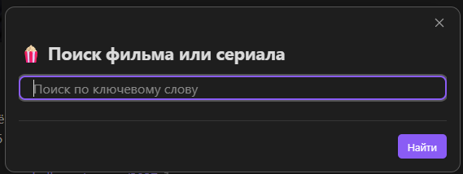
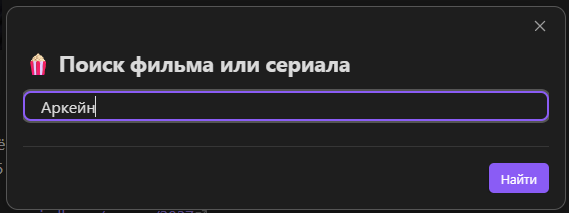
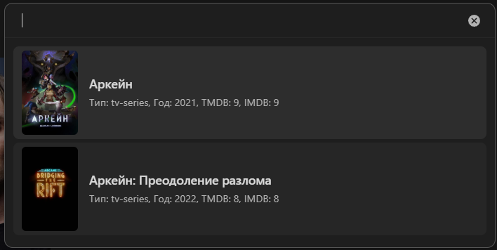
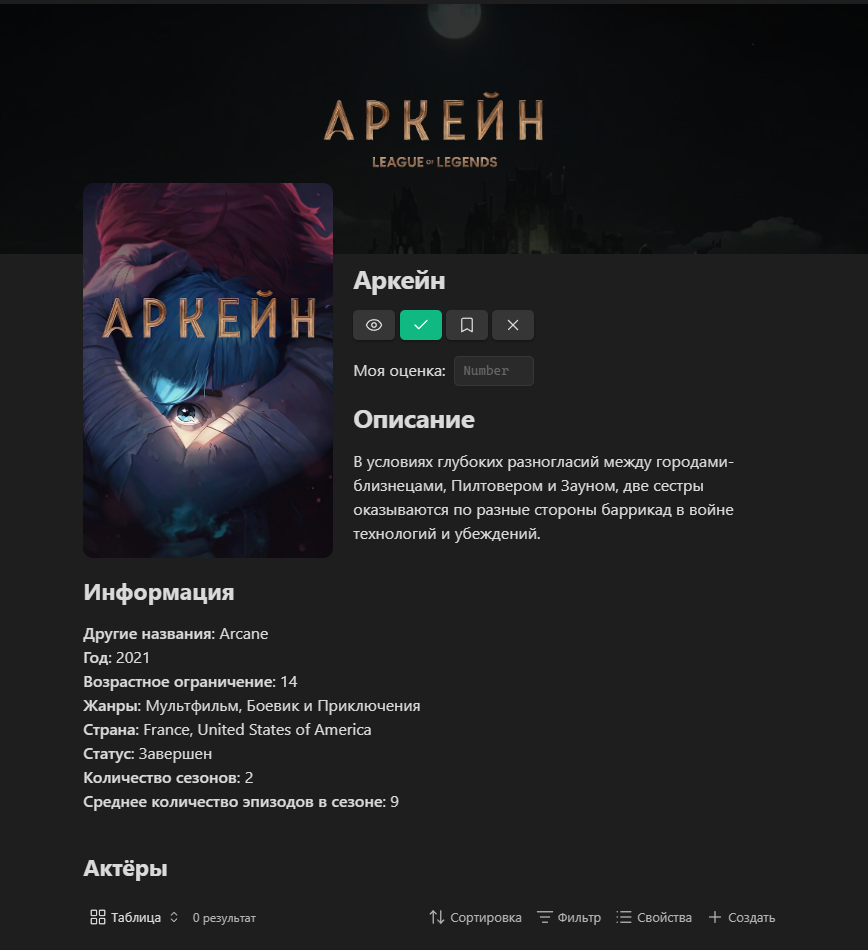
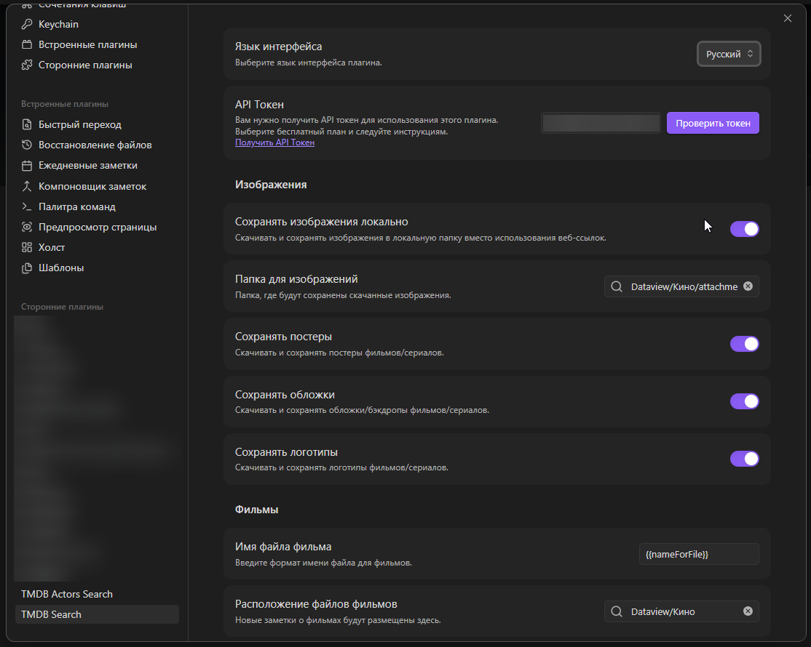

**[English](README.md)** | **Русский**

# ⚠️ Важные изменения

**Версия 2.0.0 содержит ломающие изменения.** Ознакомьтесь с [CHANGELOG (v2.0.0)](CHANGELOG.md#200--2025-08-xx) перед обновлением.

# Благодарности

Основано на оригинальной работе [Alintor](https://github.com/Alintor)

# Отличия плагина

Ключевые отличия между [оригинальным плагином](https://github.com/Alintor/obsidian-kinopoisk-plugin) и данным плагином:

1. **Расширенная поддержка переменных** - Теперь доступно больше переменных для шаблонов.
2. **Переключатель сохранения изображений** - Возможность включить/отключить сохранение изображений в хранилище.
3. **Поддержка двух языков** - Переключение между английским и русским интерфейсом.
4. **Улучшенный интерфейс и UX** – Пользовательский интерфейс и опыт взаимодействия были улучшены для более плавной работы.
5. **Лучшая совместимость с Obsidian** - Улучшенная интеграция с функциями Obsidian
6. **Исправления ошибок** - Исправлены незначительные проблемы из оригинальной версии

# Obsidian Kinopoisk Search Plus Plugin

Легко ищите информацию о фильмах и сериалах через Кинопоиск и создавайте заметки.

# Описание

Поиск информации о фильмах и сериалах из базы данных Кинопоиска.

Использует API Kinopoisk.dev для получения полной информации о фильмах и сериалах.

# Как установить

**Вариант 1:** Найдите "Kinopoisk Search Plus" в разделе плагинов сообщества Obsidian _(скоро будет доступно в Community Plugins)_

**Вариант 2:** Ручная установка - скачайте файлы последнего релиза (`main.js`, `manifest.json`, `styles.css`) из [Releases](https://github.com/2PleXXX/obsidian-kinopoisk-search-plus-plugin/releases) и поместите их в папку `.obsidian/plugins/kinopoisk-search-plus/` вашего хранилища.

# Как использовать

### 1. Нажмите на иконку в панели инструментов или выполните команду "Kinopoisk search Plus"



### 2. Найдите фильмы или сериалы по ключевым словам



### 3. Выберите элемент из результатов поиска



### 4. Готово! Заметка создана



# Настройка плагина



# Получение API токена

Для использования плагина необходим API токен.

1. Перейдите на [kinopoisk.dev](https://kinopoisk.dev/)
2. Выберите бесплатный план
3. Пройдите шаги регистрации
4. Скопируйте ваш API токен в настройки плагина

# Имя нового файла

Вы можете настроить формат имени файла для создаваемых заметок.

> **Пример:** Используя стандартный формат, "Матрица" (1999) создаст файл с именем `Матрица (1999).md`

**Стандартный формат:** `{{nameForFile}} ({{year}})`

Это создает файлы вроде "Матрица (1999).md"

**Узнайте больше о вариантах именования:** [Варианты именования файлов](#варианты-именования-файлов)

# Расположение нового файла

Укажите папку, где будут создаваться новые файлы.

Если расположение не указано, новые файлы создаются в корневой папке Obsidian.

# Сохранение изображений

Включите сохранение изображений в настройках плагина и укажите путь к папке, где будут сохраняться выбранные изображения.

**Папка по умолчанию:** `attachments/kinopoisk`

**Доступные варианты загрузки:**

-   **Постеры** - Изображения постеров фильмов/сериалов
-   **Обложки** - Широкие изображения обложек
-   **Логотипы** - Изображения логотипов фильмов/сериалов

# Файл шаблона

Вы можете указать расположение пользовательского файла шаблона для форматирования заметок о фильмах.

## Пример шаблона

Пожалуйста, обратитесь к определениям переменных шаблона ниже для доступных переменных (см.: [Определения переменных шаблона](#определения-переменных-шаблона)).

Вот пример шаблона, который лично я использую:

```
---
Кино_Постер: {{posterMarkdown}}
Кино_Название: {{alternativeName}}
Кино_Псевдоним: {{name}}
Кино_Тип: [{{type}}]
Кино_Вселенная:
Кино_ГодВыпуска: {{year}}
Кино_Жанр: [{{genres}}]
Кино_КоличествоСезонов: {{seasonsCount}}
Кино_СреднееКоличествоЭпизодов: {{seriesInSeasonCount}}
Кино_Длительность: {{movieLength}} {{seriesLength}}
Кино_СтатусПроизводства:
Кино_Страна: [{{countries}}]
Кино_Актёры: [{{actors}}]
Кино_Студия: [{{productionCompanies}}]
Кино_Режиссёр: [{{director}}]
Кино_Трейлер:
Кино_Ссылка: [{{kinopoiskUrl}}]
Кино_Оценка:
Кино_Избранное:
Кино_СтатусПросмотра:
Кино_ДатаРедактирования:
Кино_ТребуетОформления:
---

# Описание сюжета

![[{{posterPath}}|350]]

{{description}}

---
## Сиквелы и приквелы

{{sequelsAndPrequels}}

---
### Моё мнение


---
#### Связанно с [[0. MOC - Кинотеатр]]
```

Обратите внимание, что в поле `Кино_Длительность` я использую две переменных одновременно. Несмотря на то, что Obsidian будет выдавать вам ошибку, плагин всё равно будет работать с таким подходом. Так что можете пробовать использовать по несколько переменных в одном поле.

### ⚠️ Важное предупреждение по редактированию шаблонов

> **Критично:** Всегда редактируйте шаблоны только в **режиме источника**. Использование визуального редактора Obsidian автоматически переформатирует синтаксис шаблона, нарушив функциональность. Изменения шаблонов должны выполняться исключительно в режиме источника для сохранения правильного форматирования.

# Определения переменных шаблона

Здесь вы найдете определения возможных переменных для использования в шаблоне. Просто напишите `{{name}}` в вашем шаблоне и замените `name` на нужные данные, включая:

## 📖 Основная информация

| Переменная             | Описание                                          | Тип    | Список | Пример                                             |
| ---------------------- | ------------------------------------------------- | ------ | ------ | -------------------------------------------------- |
| `{{id}}`               | Уникальный идентификатор фильма в базе Кинопоиска | Число  | ❌     | `301`                                              |
| `{{name}}`             | Основное русское название фильма/сериала          | Строка | ✅     | `Матрица`                                          |
| `{{alternativeName}}`  | Альтернативное название (обычно оригинальное)     | Строка | ✅     | `The Matrix`                                       |
| `{{year}}`             | Год выхода фильма/сериала                         | Число  | ❌     | `1999`                                             |
| `{{description}}`      | Полное описание сюжета фильма                     | Строка | ✅     | `Жизнь Томаса Андерсона разделена на две части...` |
| `{{shortDescription}}` | Краткое описание фильма (1-2 предложения)         | Строка | ✅     | `Хакер Нео узнает о существовании Матрицы`         |

## 🖼️ Изображения

> ⚠️ **Важно:** Различайте переменные URL (прямые ссылки), переменные ImageLink (готовые markdown-ссылки) и переменные Path (для пользовательских размеров)

### Переменные URL (прямые ссылки)

Содержат только URL изображений без markdown-оформления. Всегда содержат веб-ссылки, даже если изображения загружены локально.

| Переменная      | Описание                           | Тип | Список | Пример                              |
| --------------- | ---------------------------------- | --- | ------ | ----------------------------------- |
| `{{posterUrl}}` | Прямая ссылка на постер фильма     | URL | ✅     | `https://image.tmdb.org/poster.jpg` |
| `{{coverUrl}}`  | Прямая ссылка на обложку (широкое) | URL | ✅     | `https://image.tmdb.org/cover.jpg`  |
| `{{logoUrl}}`   | Прямая ссылка на логотип фильма    | URL | ✅     | `https://image.tmdb.org/logo.png`   |

### Переменные Markdown (готовые markdown-ссылки)

Содержат готовые markdown-ссылки для отображения изображений в Obsidian. Используют локальные файлы, если изображения загружены, или веб-ссылки в противном случае.

| Переменная           | Описание                           | Тип      | Список | Пример                                  |
| -------------------- | ---------------------------------- | -------- | ------ | --------------------------------------- |
| `{{posterMarkdown}}` | Готовая markdown-ссылка на постер  | Markdown | ✅     | `![[poster.jpg]]`                       |
| `{{coverMarkdown}}`  | Готовая markdown-ссылка на обложку | Markdown | ✅     | `` |
| `{{logoMarkdown}}`   | Готовая markdown-ссылка на логотип | Markdown | ✅     | `![[logo.png]]`                         |

### Переменные Path (для пользовательских размеров)

Содержат чистые пути к файлам или URL для использования в пользовательских конструкциях markdown, особенно для изменения размеров изображений с помощью синтаксиса `![[file|size]]`.

| Переменная       | Описание                           | Тип  | Список | Пример       | Пример использования       |
| ---------------- | ---------------------------------- | ---- | ------ | ------------ | -------------------------- |
| `{{posterPath}}` | Чистый путь/имя файла для постера  | Path | ✅     | `poster.jpg` | `![[{{posterPath}}\|350]]` |
| `{{coverPath}}`  | Чистый путь/имя файла для обложки  | Path | ✅     | `cover.jpg`  | `![[{{coverPath}}\|200]]`  |
| `{{logoPath}}`   | Чистый путь/имя файла для логотипа | Path | ✅     | `logo.png`   | `![[{{logoPath}}\|100]]`   |

### Ключевые отличия

-   **Переменные URL**: Всегда содержат исходные веб-URL для внешнего доступа
-   **Переменные ImageLink**:
    -   Для загруженных изображений: используют wiki-ссылки `![[filename.jpg]]` (переносимые, работают после перемещения файлов)
    -   Для веб-изображений: используют markdown-ссылки `` (резервный вариант при сбое загрузки)
-   **Переменные Path**:
    -   Для загруженных изображений: содержат только имя файла для пользовательских wiki-ссылок
    -   Для веб-изображений: содержат полный URL (ограниченный функционал при изменении размера)

> 📝 **Примечание:** Переменные Path позволяют изменять размер изображений с помощью синтаксиса `![[file|size]]`, который работает только с локальными файлами в Obsidian.

## 🎭 Классификация

| Переменная           | Описание                                 | Тип    | Список | Пример                        |
| -------------------- | ---------------------------------------- | ------ | ------ | ----------------------------- |
| `{{genres}}`         | Жанры фильма                             | Строка | ✅     | `Фантастика, Боевик, Триллер` |
| `{{genresLinks}}`    | Жанры как ссылки Obsidian                | Ссылка | ✅     | `[[Фантастика]], [[Боевик]]`  |
| `{{countries}}`      | Страны производства фильма               | Строка | ✅     | `США, Великобритания`         |
| `{{countriesLinks}}` | Страны как ссылки Obsidian               | Ссылка | ✅     | `[[США]], [[Великобритания]]` |
| `{{type}}`           | Тип контента (фильм, сериал, мультфильм) | Строка | ✅     | `Фильм`                       |
| `{{subType}}`        | Подтип контента                          | Строка | ✅     | `Полнометражный`              |

## 👥 Участники проекта

| Переменная           | Описание                       | Тип    | Список | Пример                          |
| -------------------- | ------------------------------ | ------ | ------ | ------------------------------- |
| `{{director}}`       | Режиссёры фильма               | Строка | ✅     | `Лана Вачовски, Лилли Вачовски` |
| `{{directorsLinks}}` | Режиссёры как ссылки Obsidian  | Ссылка | ✅     | `[[Лана Вачовски]]`             |
| `{{actors}}`         | Основные актёры фильма         | Строка | ✅     | `Киану Ривз, Лоуренс Фишберн`   |
| `{{actorsLinks}}`    | Актёры как ссылки Obsidian     | Ссылка | ✅     | `[[Киану Ривз]]`                |
| `{{writers}}`        | Сценаристы фильма              | Строка | ✅     | `Лана Вачовски, Лилли Вачовски` |
| `{{writersLinks}}`   | Сценаристы как ссылки Obsidian | Ссылка | ✅     | `[[Лана Вачовски]]`             |
| `{{producers}}`      | Продюсеры фильма               | Строка | ✅     | `Джоэл Сильвер`                 |
| `{{producersLinks}}` | Продюсеры как ссылки Obsidian  | Ссылка | ✅     | `[[Джоэл Сильвер]]`             |

## ⚙️ Технические характеристики

| Переменная                | Описание                                        | Тип    | Список | Пример  |
| ------------------------- | ----------------------------------------------- | ------ | ------ | ------- |
| `{{movieLength}}`         | Продолжительность фильма в минутах              | Число  | ❌     | `136`   |
| `{{isSeries}}`            | Является ли контент сериалом                    | Булево | ❌     | `false` |
| `{{seriesLength}}`        | Средняя продолжительность эпизода в минутах     | Число  | ❌     | `45`    |
| `{{totalSeriesLength}}`   | Общая продолжительность всех эпизодов в минутах | Число  | ❌     | `2700`  |
| `{{isComplete}}`          | Завершён ли сериал                              | Булево | ❌     | `true`  |
| `{{seasonsCount}}`        | Количество сезонов сериала                      | Число  | ❌     | `3`     |
| `{{seriesInSeasonCount}}` | Среднее количество эпизодов в сезоне            | Число  | ❌     | `12`    |

## ⭐ Рейтинги и голоса

| Переменная                     | Описание                                   | Тип   | Список | Пример    |
| ------------------------------ | ------------------------------------------ | ----- | ------ | --------- |
| `{{ratingKp}}`                 | Рейтинг Кинопоиска (0-10)                  | Число | ❌     | `8.5`     |
| `{{ratingImdb}}`               | Рейтинг IMDb (0-10)                        | Число | ❌     | `8.7`     |
| `{{ratingFilmCritics}}`        | Рейтинг кинокритиков (0-10)                | Число | ❌     | `7.8`     |
| `{{ratingRussianFilmCritics}}` | Рейтинг российских кинокритиков (0-10)     | Число | ❌     | `8.1`     |
| `{{votesKp}}`                  | Количество голосов на Кинопоиске           | Число | ❌     | `524891`  |
| `{{votesImdb}}`                | Количество голосов на IMDb                 | Число | ❌     | `1789321` |
| `{{votesFilmCritics}}`         | Количество голосов кинокритиков            | Число | ❌     | `143`     |
| `{{votesRussianFilmCritics}}`  | Количество голосов российских кинокритиков | Число | ❌     | `25`      |

## 🔗 Внешние ссылки и идентификаторы

| Переменная         | Описание                                       | Тип    | Список | Пример                               |
| ------------------ | ---------------------------------------------- | ------ | ------ | ------------------------------------ |
| `{{kinopoiskUrl}}` | Прямая ссылка на страницу фильма на Кинопоиске | URL    | ✅     | `https://www.kinopoisk.ru/film/301/` |
| `{{imdbId}}`       | Идентификатор фильма в базе IMDb               | Строка | ✅     | `tt0133093`                          |
| `{{tmdbId}}`       | Идентификатор фильма в базе TMDb               | Число  | ❌     | `603`                                |
| `{{kpHDId}}`       | Идентификатор в системе Кинопоиск HD           | Строка | ✅     | `4e8f2f8e4b8b4c8d`                   |

## 📝 Дополнительная информация

| Переменная       | Описание                              | Тип    | Список | Пример                            |
| ---------------- | ------------------------------------- | ------ | ------ | --------------------------------- |
| `{{slogan}}`     | Рекламный слоган фильма               | Строка | ✅     | `Добро пожаловать в реальный мир` |
| `{{ageRating}}`  | Возрастное ограничение (годы)         | Число  | ❌     | `16`                              |
| `{{ratingMpaa}}` | Рейтинг MPAA (G, PG, PG-13, R, NC-17) | Строка | ✅     | `R`                               |

## 💰 Финансовая информация

| Переменная               | Описание               | Тип    | Список | Пример      |
| ------------------------ | ---------------------- | ------ | ------ | ----------- |
| `{{budgetValue}}`        | Сумма бюджета фильма   | Число  | ❌     | `63000000`  |
| `{{budgetCurrency}}`     | Валюта бюджета         | Строка | ✅     | `$`         |
| `{{feesWorldValue}}`     | Мировые сборы          | Число  | ❌     | `467222824` |
| `{{feesWorldCurrency}}`  | Валюта мировых сборов  | Строка | ✅     | `$`         |
| `{{feesRussiaValue}}`    | Сборы в России         | Число  | ❌     | `1200000`   |
| `{{feesRussiaCurrency}}` | Валюта сборов в России | Строка | ✅     | `$`         |
| `{{feesUsaValue}}`       | Сборы в США            | Число  | ❌     | `171479930` |
| `{{feesUsaCurrency}}`    | Валюта сборов в США    | Строка | ✅     | `$`         |

## 📅 Даты премьер

| Переменная            | Описание                              | Тип  | Список | Пример       |
| --------------------- | ------------------------------------- | ---- | ------ | ------------ |
| `{{premiereWorld}}`   | Дата мировой премьеры (ГГГГ-ММ-ДД)    | Дата | ❌     | `1999-03-24` |
| `{{premiereRussia}}`  | Дата российской премьеры (ГГГГ-ММ-ДД) | Дата | ❌     | `1999-06-10` |
| `{{premiereDigital}}` | Дата цифровой премьеры (ГГГГ-ММ-ДД)   | Дата | ❌     | `1999-12-15` |
| `{{premiereCinema}}`  | Дата кинопремьеры (ГГГГ-ММ-ДД)        | Дата | ❌     | `1999-03-31` |

## 📊 Периоды выхода и рейтинги

| Переменная              | Описание                              | Тип   | Список | Пример |
| ----------------------- | ------------------------------------- | ----- | ------ | ------ |
| `{{releaseYearsStart}}` | Год начала выхода (для сериалов)      | Число | ❌     | `2011` |
| `{{releaseYearsEnd}}`   | Год окончания выхода (для сериалов)   | Число | ❌     | `2019` |
| `{{top10}}`             | Позиция в топ-10 (0 если не включён)  | Число | ❌     | `5`    |
| `{{top250}}`            | Позиция в топ-250 (0 если не включён) | Число | ❌     | `74`   |

## 💡 Дополнительный контент

| Переменная           | Описание                               | Тип    | Список | Пример                                         |
| -------------------- | -------------------------------------- | ------ | ------ | ---------------------------------------------- |
| `{{facts}}`          | Интересные факты о фильме (максимум 5) | Строка | ✅     | `Сцены в Матрице снимались с зелёным фильтром` |
| `{{allNamesString}}` | Все известные названия фильма          | Строка | ✅     | `Matrix, Матрица, マトリックス`                |
| `{{enName}}`         | Официальное английское название        | Строка | ✅     | `The Matrix`                                   |

## 🎬 Производство и дистрибуция

| Переменная                     | Описание                      | Тип    | Список | Пример                           |
| ------------------------------ | ----------------------------- | ------ | ------ | -------------------------------- |
| `{{networks}}`                 | ТВ-сети/каналы (для сериалов) | Строка | ✅     | `HBO, Netflix`                   |
| `{{networksLinks}}`            | Сети как ссылки Obsidian      | Ссылка | ✅     | `[[HBO]], [[Netflix]]`           |
| `{{productionCompanies}}`      | Производственные компании     | Строка | ✅     | `Warner Bros., Village Roadshow` |
| `{{productionCompaniesLinks}}` | Компании как ссылки Obsidian  | Ссылка | ✅     | `[[Warner Bros.]]`               |
| `{{distributor}}`              | Дистрибьютор фильма           | Строка | ✅     | `Warner Bros.`                   |
| `{{distributorRelease}}`       | Дата выпуска дистрибьютора    | Дата   | ❌     | `1999-03-31`                     |

## 🔄 Связанные фильмы

| Переменная                    | Описание                             | Тип    | Список | Пример                                      |
| ----------------------------- | ------------------------------------ | ------ | ------ | ------------------------------------------- |
| `{{sequelsAndPrequels}}`      | Названия сиквелов и приквелов        | Строка | ✅     | `Матрица: Перезагрузка, Матрица: Революция` |
| `{{sequelsAndPrequelsLinks}}` | Связанные фильмы как ссылки Obsidian | Ссылка | ✅     | `[[Матрица: Перезагрузка]]`                 |

## 🛠️ Служебные переменные для имён файлов

| Переменная                   | Описание                                   | Тип    | Список | Пример       |
| ---------------------------- | ------------------------------------------ | ------ | ------ | ------------ |
| `{{nameForFile}}`            | Название фильма, очищенное для имени файла | Строка | ❌     | `Матрица`    |
| `{{alternativeNameForFile}}` | Альтернативное название для имени файла    | Строка | ❌     | `The Matrix` |
| `{{enNameForFile}}`          | Английское название для имени файла        | Строка | ❌     | `The Matrix` |

> 💡 **Совет:** Переменные, отмеченные "Список ✅", могут содержать несколько значений, разделённых запятыми. Чтобы указать, что переменная является списком, нужно заключить переменную в квадратные скобки "[{{name}}]".

### ℹ️ Уведомление о пустых значениях

**Некоторые переменные шаблона могут отображать пустые значения.** Это происходит, когда на исходном сайте отсутствует соответствующая информация. Это ожидаемое поведение и не требует сообщения об ошибке.

# Варианты именования файлов

**Доступные переменные для имён файлов:**

-   `{{nameForFile}}` - основное название
-   `{{alternativeNameForFile}}` - альтернативное название
-   `{{enNameForFile}}` - английское название
-   `{{year}}` - год выпуска
-   `{{id}}` - ID Кинопоиска

## Примеры форматов имён файлов

### Базовые форматы

-   `{{nameForFile}}`
-   `{{nameForFile}} ({{year}})`
-   `{{year}} - {{nameForFile}}`
-   `{{nameForFile}} [{{year}}]`
-   `[{{year}}] {{nameForFile}}`

### С альтернативными названиями

-   `{{nameForFile}} / {{alternativeNameForFile}}`
-   `{{nameForFile}} ({{alternativeNameForFile}})`
-   `{{nameForFile}} - {{alternativeNameForFile}} ({{year}})`
-   `{{alternativeNameForFile}} ({{year}})`

### С английскими названиями

-   `{{nameForFile}} / {{enNameForFile}}`
-   `{{enNameForFile}} ({{year}})`
-   `{{nameForFile}} ({{enNameForFile}}) [{{year}}]`
-   `{{enNameForFile}} - {{nameForFile}} ({{year}})`

### С типом контента

-   `[{{type}}] {{nameForFile}} ({{year}})`
-   `{{nameForFile}} ({{year}}) [{{type}}]`
-   `{{type}} - {{nameForFile}} ({{year}})`

### С ID Кинопоиска

-   `{{nameForFile}} ({{year}}) [{{id}}]`
-   `[{{id}}] {{nameForFile}} ({{year}})`
-   `{{nameForFile}} - {{id}}`

### Сложные комбинации

-   `{{year}} - {{nameForFile}} / {{enNameForFile}} [{{type}}]`
-   `{{nameForFile}} ({{year}}) - {{enNameForFile}} [ID-{{id}}]`

## Примеры результатов

-   `Титаник (1997)`
-   `1997 - Титаник`
-   `Титаник / Titanic (1997)`
-   `[326] Титаник (1997)`

> **Примечание:** Вы можете экспериментировать с различными комбинациями переменных, включая переменные, не упомянутые здесь. Однако я не могу гарантировать правильную работу в таких случаях. 😊

# Узнайте больше о плагине

Вы можете скачать пример хранилища из репозитория и открыть его локально. Хранилище содержит всё необходимое для понимания работы плагина.

**Вариант 1:** Клонируйте репозиторий и откройте папку `Example Vault` как хранилище Obsidian  
**Вариант 2:** Скачайте архив хранилища напрямую

-   [Клонировать репозиторий](https://github.com/2PleXXX/obsidian-kinopoisk-search-plus-plugin)
-   [Скачать архив примера хранилища](https://github.com/2PleXXX/obsidian-kinopoisk-search-plus-plugin/releases/download/2.0.0/Example.Vault.rar)

# Лицензия

[Obsidian Kinopoisk Plus Plugin](https://github.com/2PleXXX/obsidian-kinopoisk-search-plus-plugin) лицензирован под лицензией GNU AGPLv3. Обратитесь к [LICENSE](https://github.com/2PleXXX/obsidian-kinopoisk-search-plus-plugin/blob/main/LICENSE) для получения дополнительной информации.

# Связанные инструменты

-   **[Obsidian Dataview Cards](https://github.com/2PleXXX/obsidian-dataview-cards)** - Сопутствующий скрипт (не плагин), который отображает метаданные фильмов в виде красивых карточек, идеально дополняя этот плагин. Посмотрите репозиторий для подробной информации и инструкций по настройке.
